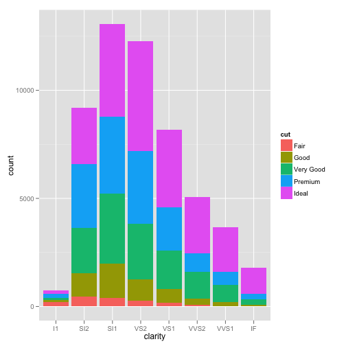

## Read-And-Delete

1. Edit YAML front matter
2. Write using R Markdown
3. Use an empty line followed by three dashes to separate slides!

--- .class #id 

## Slide 1

CPM, 到底有什麼特別?

> 1. Linguistics: a data-intensive discipline? 
> 2. Corpus data science
> 3. Pre-processing
> 4. (Corpus-based) Exploratory Data Analysis 
> 5. Hypothesis and Testing
> 6. Statistical Modeling
> 7. Demo: Shiny-LexicoR 

---

## Motion Chart

<!-- MotionChart generated in R 2.15.1 by googleVis 0.2.17 package -->
<!-- Mon Feb 18 17:29:35 2013 -->

<!-- jsHeader -->

 
<!-- divChart -->
  

---

## ggplot2

  carat       cut color clarity depth table price    x    y    z
1  0.23     Ideal     E     SI2  61.5    55   326 3.95 3.98 2.43
2  0.21   Premium     E     SI1  59.8    61   326 3.89 3.84 2.31
3  0.23      Good     E     VS1  56.9    65   327 4.05 4.07 2.31
4  0.29   Premium     I     VS2  62.4    58   334 4.20 4.23 2.63
5  0.31      Good     J     SI2  63.3    58   335 4.34 4.35 2.75
6  0.24 Very Good     J    VVS2  62.8    57   336 3.94 3.96 2.48
 

---
